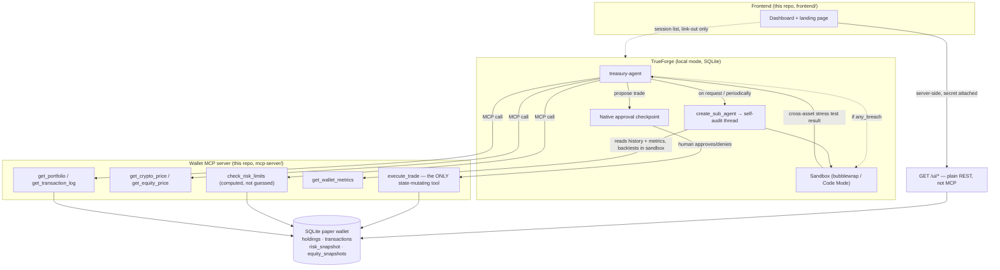

<p align="center">
  
</p>

<h1 align="center">TreasuryForge</h1>

<p align="center">
  <em>Everything runs without you. Nothing executes without you.</em>
</p>

<p align="center">
  <a href="https://github.com/codedpool/treasuryforge/actions/workflows/tests.yml"></a>
  
  
  <a href="https://www.wemakedevs.org/hackathons/trueforge"></a>
</p>

An autonomous multi-asset treasury agent — cash, BTC/ETH, and a basket of NSE
equities — built natively on [TrueForge](https://trueforge.dev), TrueFoundry's
open-source agent harness. Built for the WeMakeDevs × TrueFoundry
[Agent Harness Hackathon](https://www.wemakedevs.org/hackathons/trueforge).

The point of this project is not profitability. It's a demonstration of a
**safe, autonomous decision engine**: real tool use across two asset classes,
generated code running in an isolated sandbox for actual pre-trade analysis,
a native human approval gate before anything irreversible, full visibility
into every decision's reasoning, and a self-audit sub-agent that reviews its
own performance and proposes rule changes — all as TrueForge primitives, not
a custom app with an LLM call bolted on.

---

## Table of contents

- [Why TrueForge is central, not a wrapper](#why-trueforge-is-central-not-a-wrapper)
- [Architecture](#architecture)
- [Multi-asset scope](#multi-asset-scope)
- [The decision loop](#the-decision-loop)
- [Risk limits and approval triggers](#risk-limits-and-approval-triggers)
- [The self-audit sub-agent](#the-self-audit-sub-agent)
- [MCP tool surface](#mcp-tool-surface)
- [How to run it](#how-to-run-it)
- [Testing](#testing)
- [Debug / demo-only endpoints](#debug--demo-only-endpoints)
- [Design decisions](#design-decisions)
- [Known limitations](#known-limitations)
- [Qodo Code Review Evidence](#qodo-code-review-evidence)
- [Data security](#data-security)
- [Project status](#project-status)

---

## Why TrueForge is central, not a wrapper

The hackathon's own rule for this: *"A judge has to see TrueForge reaching a
tool, running code in the sandbox, and stopping for a person. If it would
work just as well as a chat box, change the project."*

Nothing here is custom orchestration. Every piece of the loop is a TrueForge
primitive, driven entirely through TrueForge's own HTTP API
(`/api/v1/sessions`, `/api/v1/sessions/{id}/turns`):

| What happens | TrueForge primitive |
|---|---|
| The agent calls a tool | A registered **remote MCP server** (this repo's `mcp-server/`), not a function called directly from app code |
| A trade pauses for a human | TrueForge's native **approval checkpoint** (`require_approval_for_tools`), not a custom `/approvals` endpoint |
| Pre-trade analysis code runs | TrueForge's own **sandbox** (bubblewrap-isolated, Code Mode), not a subprocess we spawn |
| Periodic self-review | TrueForge's native **`create_sub_agent`** capability, a real child thread in the session, not the main agent just reasoning longer |
| Every step is inspectable | TrueForge's own **session/turn event trace**, not a log file we wrote |

We proved this live, end to end, twice — once for the approval gate +
sandbox stress test (Phase 2), once for the self-audit sub-agent (Phase 3).
Both proofs are written up in detail with real request/response data in this
repo's development history (see the merged PRs linked in
[Qodo Code Review Evidence](#qodo-code-review-evidence)).

## Architecture



The wallet MCP server runs as its own process (Streamable HTTP — TrueForge
only registers *remote* MCP servers, not stdio) and is the **only** thing
that can touch the SQLite-backed paper wallet. TrueForge never mutates
wallet state directly; it only ever calls `execute_trade` through MCP, and
that call is gated behind TrueForge's own approval checkpoint plus a shared
secret only TrueForge is configured with (see
[Design decisions](#design-decisions)).

## Multi-asset scope

Deliberately small, not full-market coverage:

- **Crypto**: BTC, ETH, priced via CoinGecko (free, no auth).
- **Equities**: `RELIANCE.NS`, `TCS.NS`, `INFY.NS`, `HDFCBANK.NS` — a free
  Yahoo-Finance-style chart endpoint primary, Twelve Data free tier as
  fallback if it rate-limits.
- **No real FX modeling.** Everything is tracked internally in USD; INR
  equity prices are converted at a fixed constant for display only. FX risk
  is explicitly out of scope — see [Design decisions](#design-decisions).
- **Market-hours awareness as a feature.** The equity tool returns a
  `market_open` boolean (NSE, 09:15–15:30 IST, weekdays), computed
  independently of whatever the quote source's own market-state field says.
  Outside those hours, `execute_trade` **hard-rejects** new equity trades —
  the agent can hold or monitor, not trade blind against a stale quote.

Adding equities alongside crypto is what makes "treasury" the right word
instead of a rebranded crypto bot, and gives the sandbox stress test a
genuinely richer job: a correlated cross-asset-class shock, not a
single-asset volatility toy.

## The decision loop

1. **Evidence.** The agent calls `get_portfolio` and `get_transaction_log` —
   read-only, current holdings and recent history.
2. **Risk check.** For any trade under consideration, the agent calls
   `check_risk_limits` with the exact same arguments it's about to propose.
   This is a **computed** answer, not the model's own estimate — see why
   that distinction matters below.
3. **Sandbox stress test (conditional).** If `check_risk_limits` reports
   `any_breach: true`, the agent runs exactly one Python script in
   TrueForge's sandbox: it pastes in the position values already fetched
   (no network access from inside the sandbox — there is none), applies a
   correlated shock (crypto down 20%, equities down 10%), and computes the
   resulting portfolio drawdown. That number gets cited alongside
   `check_risk_limits`' numbers.
4. **Propose the trade.** The agent calls `execute_trade` with its full
   reasoning. This call **always** pauses for human approval — TrueForge's
   checkpoint is unconditional, it has no notion of "only pause if this
   breaches a limit" (verified directly against TrueForge's own source, not
   assumed). `execute_trade` also independently computes and stores its own
   risk snapshot server-side at this point — it does not trust whatever the
   agent claims in `reason`.
5. **Human decision.** Approve or deny, via TrueForge's own
   `user.tool_approval` turn input.
6. **Execute (or not) and log.** Respecting `DRY_RUN` (see below), the trade
   is priced, logged with its full risk snapshot, and an equity-curve point
   is recorded.
7. **Self-audit (periodic / on request).** A TrueForge sub-agent reviews
   recent decisions, computes real performance metrics, backtests an
   alternative risk threshold, and proposes rule adjustments with that
   backtest evidence attached.

### Why a *computed* risk check, not just agent reasoning

TrueForge's approval checkpoint is coarse: it pauses **every**
`execute_trade` call, unconditionally. There's nothing in the manifest
schema to make that conditional on "only if this breaches a limit." So the
four risk triggers the plan calls for can't live in TrueForge's own config —
they live in `check_risk_limits`, a read-only MCP tool that computes real
numbers from the actual portfolio/transaction history (average-cost-basis
P&L, a rolling daily-drawdown baseline, live concentration math) instead of
asking the model to eyeball them. The human at the approval checkpoint sees
a real number, not an LLM's unverified claim about one.

## Risk limits and approval triggers

| Trigger | Threshold | Computed from |
|---|---|---|
| Daily drawdown | > 5% | Current total value vs. a lazily-rolled UTC-day-start baseline |
| Consecutive losses | > 2 | Realized P&L of the most recent *executed* sells, average-cost-basis accounting |
| Single-asset concentration | > 50% of portfolio | Projected post-trade USD value of the traded asset |
| "Sell all" | Selling ≥ 99% of a position | Current holding vs. proposed sell quantity |
| Equity trade while market closed | N/A — hard-rejected, not gated | NSE hours check, independent of the quote source |

Every trigger except the market-hours one flows through `check_risk_limits`
and, when breached, into the sandbox stress test described above. The
market-hours rule is a hard rejection inside `execute_trade` itself, not an
approval-routed trigger — there's no live, tradeable price to gate a
decision on once the market is closed.

All four gated triggers have a matching force-trigger debug endpoint (see
[Debug / demo-only endpoints](#debug--demo-only-endpoints)) so each can be
demonstrated on cue instead of waiting for the agent to happen into one
naturally. Consecutive-losses specifically has no natural path to firing at
all under the default `DRY_RUN=true`, since DRY_RUN sells are correctly
excluded from realized P&L — its debug endpoint is the only way to see that
particular gate fire without flipping `DRY_RUN` off first.

## The self-audit sub-agent

TrueForge's `dynamic_sub_agents` capability exposes one tool to the model:
`create_sub_agent(name, input)`. A sub-agent has **no access to the parent
conversation** — `input` has to be a fully self-contained task — but it
**inherits the same tools and the same sandbox** as the parent, and spawning
one creates a genuine, separate child thread in the session's own trace.

The treasury agent is instructed to delegate self-audits to one of these,
on request or its own initiative after several new trades. The task it
hands the sub-agent:

1. Review the last 20 decisions via `get_transaction_log` — each carries a
   `risk_snapshot` (the actual computed numbers from that moment), except
   seed rows and any trade from before that field existed, which the
   sub-agent is told to explicitly exclude and disclose the resulting
   sample size for, rather than assume full coverage.
2. Pull `get_wallet_metrics` for realized/unrealized P&L, win rate, max
   drawdown, and Sharpe.
3. Run exactly one sandbox script backtesting an alternative daily-drawdown
   threshold (e.g. 7% instead of 5%) against the `risk_snapshot` data
   already fetched — no network calls needed, it's all in that data.
4. Return a concise summary with the backtest evidence attached.

Real example output from a live proof run (seeded with realistic synthetic
history for the test — see the linked PR for full detail):

> **Current Threshold (5%):** 3 decisions breached the limit (drawdowns
> between 5.48% and 5.84%). **Alternative Threshold (7%):** 0 decisions
> would have breached. *Suggestion: relax the daily drawdown threshold from
> 5% to 7% — the current threshold flagged 3 of 20 recent trades as
> breaches despite portfolio equity remaining stable, while 7% still
> safely bounds risk below the historical 6.1% max drawdown observed.*

## MCP tool surface

All tools live in `mcp-server/app/server.py`, registered as one remote MCP
server (`treasuryforge-wallet`).

| Tool | Mutates state? | Purpose |
|---|---|---|
| `get_portfolio` | No | Cash, every holding, live USD value, total, day-start baseline |
| `get_transaction_log` | No | Recent trades (+ seed), each with its `risk_snapshot` |
| `get_crypto_price` | No | CoinGecko price + 24h change |
| `get_equity_price` | No | NSE quote (INR + USD), 24h change, `market_open` |
| `check_risk_limits` | No | Computed answer to "would this trade breach a limit" |
| `get_wallet_metrics` | No | Realized/unrealized P&L, win rate, max drawdown, Sharpe |
| `execute_trade` | **Yes — the only one** | Buy/sell; approval-gated; computes and stores its own risk snapshot |

The frontend dashboard doesn't call any of these directly — a browser can't
speak MCP. It reads the same underlying data through a separate, plain-REST
`GET /ui/*` surface on the same server (see
[Design decisions](#design-decisions)), which wraps these same functions
but was never registered with TrueForge and isn't part of the agent's own
tool surface.

## How to run it

### Prerequisites

- Python 3.12+
- Node.js 22+
- TrueForge needs a Linux or macOS host for its sandbox to work at all
  (bubblewrap is Linux-only). On Windows, that means **WSL2** — see
  `scripts/setup-wsl-sandbox.sh` and the note below. A Windows-native
  TrueForge install still works for everything *except* the sandbox (see
  `runtime/trueforge/patch-windows-esm-migrations.js`).

### 1. Wallet MCP server

```bash
cd mcp-server
python -m venv .venv
cp .env.example .env   # defaults work as-is; nothing is required to start
```

**Windows (PowerShell):**

```powershell
.\.venv\Scripts\python.exe -m pip install -r requirements.txt
.\.venv\Scripts\python.exe -m app.server
```

**Windows (Git Bash):**

```bash
.venv/Scripts/python.exe -m pip install -r requirements.txt
.venv/Scripts/python.exe -m app.server
```

**Linux/macOS:**

```bash
.venv/bin/pip install -r requirements.txt
.venv/bin/python -m app.server
```

Runs on `http://127.0.0.1:4001` by default. On first call it auto-seeds the
wallet ($10,000 notional: 50% cash, 30% crypto, 20% equities, weights
computed from live prices so the split is real regardless of what BTC/ETH
are trading at) and generates a shared secret at `data/.wallet_secret`.

### 2. TrueForge

**Windows, via WSL2 (recommended — needed for the sandbox):**

```bash
wsl -d Ubuntu -u root -- bash scripts/setup-wsl-sandbox.sh
# then inside WSL: install Node 22, npm install @truefoundry/trueforge@0.1.4, run it
```

Requires `networkingMode=mirrored` in `%USERPROFILE%\.wslconfig` so WSL can
reach the wallet server on the Windows host's `127.0.0.1`. See the comments
at the top of `scripts/setup-wsl-sandbox.sh` for the full reasoning and a
`--revert` option.

**Windows-native (no sandbox, everything else works):**

```bash
cd runtime/trueforge
npm install   # postinstall applies the Windows ESM-migration patch
npm start
```

**Linux/macOS (native, no detour needed):**

```bash
npm install -g @truefoundry/trueforge@0.1.4
npx @truefoundry/trueforge
```

TrueForge serves its own built-in web UI at whatever port it starts on
(`http://localhost:8790` by default) — usable today for driving sessions by
hand, ahead of this repo's own dashboard (see [Project status](#project-status)).

### 3. Register everything

```bash
cp .env.example .env   # fill in at least one of OPENROUTER_API_KEY / GEMINI_API_KEY / GROQ_API_KEY
pip install -r scripts/requirements.txt
python scripts/setup_trueforge.py
```

With both processes running, this reads the repo-root `.env` (see
`.env.example` for every variable it looks at) and registers everything
against TrueForge.

Idempotent and safe to re-run — it registers the model provider(s), the
wallet MCP server (with header auth), the Daytona sandbox provider if
`DAYTONA_API_KEY` is set, and creates (or updates in place, preserving
anything you've customized directly) the `treasury-agent`. If you're not
running TrueForge on the default port, set `TRUEFORGE_URL` first.

### 4. Talk to it

Drive the agent itself via TrueForge's own UI, or its HTTP API directly
(substitute your own host:port if you didn't run TrueForge on its default
`8790`):

```bash
curl -X POST http://localhost:8790/api/v1/sessions \
  -H "Content-Type: application/json" \
  -d '{"agent":{"name":"treasury-agent"}}'

# Take the "id" from that response and use it below.
curl -X POST http://localhost:8790/api/v1/sessions/{id}/turns \
  -H "Content-Type: application/json" \
  -d '{"input":[{"type":"user.message","content":"Review the portfolio and propose a trade if warranted."}]}'
```

### 5. Frontend dashboard

A plain JS/JSX Next.js 14 app (`frontend/`) — landing page plus a dashboard
reading the wallet server's data live: portfolio, P&L/allocation charts,
decision log, risk panel (with the four force-trigger demo buttons), a
TrueForge-connectivity-aware approval queue, Quant Desk, and a Markdown
audit export.

```bash
cd frontend
npm install
cp .env.example .env.local
```

Edit `.env.local`: set `WALLET_SHARED_SECRET` to the contents of
`mcp-server/data/.wallet_secret`, and confirm `WALLET_SERVER_URL`/
`TRUEFORGE_URL` match wherever those are actually running. The wallet
server's own shared secret never reaches the browser — every
`app/api/wallet/*` route runs server-side and attaches it there; the
frontend's own `.env.local` is a *second*, separate secret store from the
wallet server's, not a duplicate of anything already public.

`DASHBOARD_ACCESS_SECRET` is optional and left unset by default — no
login prompt for local dev. Set it to a real value only before deploying
the dashboard somewhere reachable by someone other than you (see
[Design decisions](#design-decisions)).

```bash
npm run dev
```

Open `/dashboard` directly — no login prompt, unless you set
`DASHBOARD_ACCESS_SECRET` above, in which case the browser will ask for
credentials the first time (any username, that value as the password).

Open `http://localhost:3000`. If the dashboard shows "wallet server isn't
reachable," start the wallet server (step 1) — and if you already had it
running from before pulling this feature, restart it, since the
`GET /ui/*` routes the dashboard depends on are new.

## Testing

Both the wallet server's logic and `scripts/setup_trueforge.py`'s pure
functions have a pytest suite — 105 tests, none requiring network access or
a running TrueForge/wallet instance (prices are mocked; SQLite runs against
a throwaway per-test file, never the real dev `wallet.db`). Runs in CI
(`.github/workflows/tests.yml`) on every push and every pull request.

```bash
cd mcp-server && pip install -r requirements-dev.txt && pytest
cd scripts && pip install -r requirements-dev.txt && pytest
```

Covers: `execute_trade`'s full validation surface and DRY_RUN/live
behavior, the average-cost-basis P&L accounting (including DRY_RUN
exclusion), all four risk triggers individually and all four force-trigger
debug endpoints (including their input validation and, for concentration,
the every-position-must-be-priced check), `max_drawdown_pct`/`sharpe_ratio`
against known synthetic curves, the day-start and periodic equity-snapshot
recording (including refusing to snapshot while any position is unpriced),
schema migration idempotency, and the manifest-merge logic that updates an
existing agent without erasing its customizations. Several of these tests
found real bugs while being written — not just confirmed existing behavior
— including a Sharpe-ratio edge case where near-zero floating-point
variance (not exactly zero) produced a meaningless enormous ratio instead
of the `None` a flat equity curve should report, and (per PR #6's Qodo
review) a debug endpoint that could report a forced breach without actually
forcing one.

**The frontend has no automated test suite yet** — `npm run build`
(production build, catches every syntax/import/type error across all
routes) plus manual smoke-testing against a live wallet server (every page
and API route checked for a 200 and real data, not just a clean build) is
the verification it's had so far. Worth stating plainly rather than
implying JS coverage that doesn't exist.

## Debug / demo-only endpoints

Never called from the agent's own decision loop — for local testing and
demo reliability only:

- `GET /health` — liveness check (the only route that skips the shared-secret check).
- `POST /debug/reset` — wipes and reseeds the wallet.
- `POST /debug/trigger-approval` — synthesizes a daily-drawdown breach (rolls
  the stored baseline back) so a demo can reliably show the approval gate
  firing over a real computed number, without hoping the agent proposes a
  risky trade naturally on camera.
- `POST /debug/trigger-approval/concentration?asset=BTC&margin_pct=1` —
  overwrites `asset`'s holding so it alone already exceeds the 50%
  concentration limit; the next `check_risk_limits` call proposing to **buy**
  that asset reports a genuine breach (a large enough sell can still
  legitimately bring projected concentration back under the limit, since the
  trigger evaluates the post-trade holding, not the current one). Refuses to
  run if *any* held position is unpriced (not just the target asset), and
  `margin_pct` must be strictly between 0 and 50 — either bound would either
  fail to breach or divide by zero in the underlying math.
- `POST /debug/trigger-approval/sell-all?asset=BTC&quantity=0.05` —
  overwrites `asset`'s holding to exactly `quantity` and returns it, so a
  follow-up sell of that same quantity reliably trips the sell-all trigger
  without first having to read the live (often long-decimal) holding.
- `POST /debug/trigger-approval/consecutive-losses?count=3` — writes `count`
  synthetic losing sells straight into the transaction log, under an
  isolated `DEMO_LOSS` ticker that can never blend into or corrupt a real
  asset's cost basis. The only one of the four triggers with no natural way
  to fire on demand at all under `DRY_RUN=true`. `count` must exceed the
  consecutive-loss limit (2) — a smaller count wouldn't actually breach it.

Every debug route above is cleared by `POST /debug/reset`.

## Design decisions

- **`DRY_RUN=true` by default.** Every trade is priced and logged, but
  `execute_trade` returns before touching cash/holdings. Flip it only when
  you deliberately want real (paper) execution.
- **The wallet MCP server is the only execution path**, and it's the only
  module in `mcp-server/app/` that mutates state — everything else (pricing,
  seed, risk, metrics) only reads or is read from it.
- **The frontend never sees `WALLET_SHARED_SECRET`.** The wallet's data
  tools are MCP-only, which a browser can't speak, so `frontend/` gets a
  small read-only REST facade (`GET /ui/*`) instead — but every
  `app/api/wallet/*` route handler that calls it runs server-side in
  Next.js and attaches the secret there (`lib/walletProxy.js`, guarded by
  the `server-only` package). The browser only ever talks to the
  frontend's own `/api/*` routes.
- **The frontend has its own, separate access gate — opt-in.** Attaching
  `WALLET_SHARED_SECRET` server-side only protects the *second* hop
  (Next.js → wallet server) — without a gate of its own, the Next.js app
  is a fully unauthenticated proxy handing out full wallet read/write
  access to anyone who can reach it. `middleware.js` can gate `/dashboard`
  and every `/api/wallet/*`/`/api/trueforge/*` route behind HTTP Basic Auth
  checked against a *different* secret, `DASHBOARD_ACCESS_SECRET` — but
  only when that secret is actually set. Local development has no one else
  who can reach the app, so it defaults to open, no login prompt; set the
  secret before deploying the dashboard anywhere reachable by someone else.
  Basic Auth over a custom login flow: zero UI code, the browser's own
  prompt and credential cache do the work, and it matches this project's
  existing "shared secret, not a full auth system" posture instead of
  inventing a second one.
- **The sandbox is read-only and advisory by construction**: it gets a
  handful of literal numbers pasted in, has no network egress, and no
  wallet MCP access from within a generated script. It informs the
  reasoning behind a trade; it never places one.
- **FX conversion is out of scope.** Everything is tracked internally in
  USD; INR is a fixed-rate display conversion only, not a live rate. Real
  FX risk on the equity leg is a known, stated simplification.
- **A localhost bind is not the security boundary.** It stops remote
  callers, not another local process calling `execute_trade` directly and
  skipping TrueForge's approval checkpoint entirely. Every request but
  `/health` requires a shared secret (`X-Wallet-Secret`), generated on first
  run and handed to TrueForge via its own supported header-auth mechanism
  for remote MCP servers — not something invented for this.
- **The risk snapshot is computed server-side, not agent-trusted.**
  `execute_trade` calls `check_risk_limits` itself for the exact trade being
  proposed and stores that result with the transaction — a tool argument
  can't be verified, so nothing previously guaranteed the agent had actually
  run the check first.
- **The daily-drawdown baseline is a real but honest simplification.** It's
  a lazily-rolled UTC-day snapshot established on the first portfolio read
  of each day (not a true midnight-UTC snapshot — there's no scheduler for
  a local paper wallet), so a drop before the very first read of a given
  day can still be invisible. Documented, not hidden.
- **Sharpe ratio is deliberately left unannualized.** It's computed from an
  equity-snapshot series recorded on trades, daily rollovers, and a
  lazily-checked periodic top-up (below) — still not a true fixed interval,
  since the periodic check only fires when something calls `get_portfolio`
  — and annualizing implies a regular observation cadence that data doesn't
  have. An annualized number computed from irregularly-spaced session data
  would be more misleading than useful.
- **The periodic equity snapshot has no scheduler either.** Like the
  day-start baseline, it's a lazy check inside `get_portfolio`: if it's
  been at least 5 minutes since the last recorded snapshot, it records
  another one. This closes most of the gap a purely trade-driven curve
  would otherwise have during an idle stretch, without a background thread
  or cron job — but it's still bounded by how often something actually
  reads the portfolio, not true fixed-interval mark-to-market.
- **OpenRouter's `minimax-m3` is the default primary model**, ahead of
  Gemini and Groq. All three get registered if their keys are present, but
  real same-day testing surfaced hard limits in the other two: Gemini's
  free-tier quota exhausted mid-testing, and Groq's 8,000 TPM ceiling proved
  too tight against this agent's ~4,600-token fixed per-turn overhead.
  OpenRouter's free-tier `minimax-m3` and `nemotron-3-super` were each
  verified with a real multi-turn tool-call round trip before being wired
  in — two other free models that also claimed tool support failed on the
  first call with a provider-side 429. TrueForge's agent manifest takes one
  `model.name`; there's no automatic runtime fallback between providers, so
  this is a fixed preference order applied at registration time
  (`resolve_primary_model_name` in `scripts/setup_trueforge.py`), not live
  failover. `PRIMARY_MODEL_NAME` overrides it explicitly.

## Known limitations

Documented rather than silently absent:

- **Daytona sandbox provider doesn't work here.** Registration fails
  because the account can't pull TrueFoundry's own private-registry sandbox
  image — a structural limitation of a personal (non-TrueFoundry-issued)
  Daytona account, not a bug in this repo. TrueForge's **local** sandbox
  provider (bubblewrap, via WSL2 on Windows) is the sandbox path this
  project actually runs on, and it's fully functional.
- **Sandbox guardrails are partial.** Daytona's config is set for a 10s
  execution timeout, but since Daytona itself doesn't work, the local
  sandbox fallback runs on TrueForge's own built-in 60s default — not
  independently configurable in this TrueForge version — and has no
  separate memory cap.
- **Two TrueForge instances can exist side by side on Windows+WSL2** (a
  Windows-native one, sandbox-incapable; a WSL one, fully capable) with
  entirely separate agent registrations. `TRUEFORGE_URL` must point at
  whichever one you actually mean.
- **No real backtesting price history.** The self-audit sub-agent's
  backtest replays the *already-computed* risk numbers stored per trade
  (`risk_snapshot`), not a full historical market-price simulation — there's
  no stored price series to run one against.

## Qodo Code Review Evidence

Every substantive change went through a pull request reviewed by
[Qodo](https://qodo.ai) before merging, per the hackathon's code-review
requirement. All eight are merged into `main` (a ninth PR, a docs-only
README update, had nothing for Qodo to flag and isn't listed below):

- **[PR #1 — Phase 1 foundation](https://github.com/codedpool/treasuryforge/pull/1)**:
  wallet MCP server, TrueForge runtime, registration script. Qodo caught —
  and this PR fixed — trade approval being bypassable via direct MCP access
  (server bound to `0.0.0.0`), a reset endpoint permitting unauthenticated
  data loss, negative/non-finite trade amounts inverting balance math,
  unserialized concurrent trades, and a Groq-only setup silently defaulting
  to an unregistered Gemini model.
- **[PR #2 — Phase 2](https://github.com/codedpool/treasuryforge/pull/2)**:
  computed risk checks, sandbox stress test, force-trigger endpoint. Qodo
  caught DRY_RUN-mode trades being counted as real realized losses, a
  risk-check baseline that could hide a same-day drop, and a missing-quote
  case that would silently understate portfolio risk instead of refusing
  to compute it.
- **[PR #3 — Phase 3](https://github.com/codedpool/treasuryforge/pull/3)**:
  wallet metrics, per-trade risk snapshots, self-audit sub-agent. The
  deepest review chain of the three — 9 findings across 3 rounds, including
  `execute_trade` reporting failure to the caller *after* a trade had
  already committed (a real double-execution risk on retry), and two
  rounds where fixing one finding (agent re-registration silently never
  reaching an already-existing agent) introduced a new one (the fix
  itself wholesale-replacing, then partially wholesale-replacing, a
  customized agent's manifest) — each caught and fixed in turn.
- **[PR #4 — README and root `.env.example`](https://github.com/codedpool/treasuryforge/pull/4)**:
  Qodo caught inaccurate setup instructions — a blank `KEY=` env var not
  actually falling back to its default, curl examples missing
  `Content-Type: application/json`, and a venv-activation command that
  doesn't work the same way in PowerShell vs. Git Bash.
- **[PR #5 — pytest suite and CI](https://github.com/codedpool/treasuryforge/pull/5)**:
  82 tests plus GitHub Actions. Qodo caught a migration race-condition test
  that wasn't actually exercising the race it claimed to (fixed with a
  proxy connection that lies about `PRAGMA table_info`, verified by
  temporarily sabotaging the code under test and confirming the test then
  failed), and — across four review rounds — a CI trigger that only ran on
  pushes to `main`, contradicting the README's own "runs on every push"
  claim.
- **[PR #6 — Remaining force-trigger endpoints and periodic equity
  snapshot](https://github.com/codedpool/treasuryforge/pull/6)**: the other
  three risk triggers' debug endpoints, plus a lazy periodic equity
  snapshot. The first review pass found 8 real issues in one pass —
  `force_concentration_breach`'s `margin_pct` and `force_consecutive_losses_breach`'s
  `count` were both unvalidated and could report a forced breach without
  actually forcing one; the concentration helper read the portfolio and
  wrote the new holding as two separate, unlocked steps, so a concurrent
  trade or reset could land in between and get silently overwritten; the
  synthetic losing-streak inserts had the same problem one row at a time;
  the periodic snapshot could record an incomplete, permanently-wrong
  equity point when a held position had no live quote; and two
  concurrent `get_portfolio` calls could both pass the periodic snapshot's
  "is one due" check and double-insert. All eight fixed and confirmed
  resolved on the follow-up pass.

- **[PR #8 — Phase 4 frontend (initial)](https://github.com/codedpool/treasuryforge/pull/8)**:
  the first landing page + dashboard build. Ten findings across four
  rounds — two High-severity ones (every new wallet/TrueForge proxy route
  was reachable with no auth of its own, since the shared secret only
  protects the *second* hop) became the opt-in `DASHBOARD_ACCESS_SECRET`
  Basic-Auth gate documented in [Design decisions](#design-decisions); the
  audit export silently truncating history past 200 transactions and
  swallowing non-portfolio fetch failures as if the data were genuinely
  empty; and a cascade like PR #3's — switching the new UI routes to
  synchronous handlers (to stop blocking FastAPI's event loop) made
  concurrent day-start rollovers race for the first time, and each of the
  next two rounds caught a new bug in that same rollover fix (a CSRF gap on
  originless requests, then a lock-ordering bug that could still regress
  the baseline to yesterday's date) before it was actually correct.
- **[PR #9 — Dashboard/landing redesign, plus reliability fixes](https://github.com/codedpool/treasuryforge/pull/9)**:
  the parchment-themed dashboard retheme. Caught a real stale-price bug (a
  CoinGecko refresh that omitted an asset left its old cached quote
  servable forever instead of expiring it), a cache stampede (concurrent
  dashboard requests could all miss the cache and all fire duplicate
  CoinGecko calls before any of them finished populating it), and two
  below-the-fold landing images marked `priority`, competing with the
  actual hero image for the initial load. One finding — production auth
  failing open when `DASHBOARD_ACCESS_SECRET` is unset — was dismissed
  rather than fixed, on the record: this project has one operator and one
  deployment target, not a separate production environment to fail closed
  in. A follow-up finding on the cache fix itself (one coarse lock also
  blocks fresh-cache reads behind a slow refresh) was left as-is for the
  same reason — only two crypto IDs ever exist, so the contention it flags
  is real but negligible next to the correctness the lock buys.

Every finding across all eight PRs was a genuine, reproducible issue in the
diff, not a style nitpick — see each PR's review thread for the full detail.
A few (concurrency races around the SQLite migration, equity-snapshot
ordering, and the concentration/consecutive-losses debug helpers) needed
real concurrent access to actually trigger, which is unlikely given this
project's actual shape (single agent, approval-gated, local, one operator);
those were fixed anyway since they were cheap, but are lower-stakes than
the correctness findings that would surface under completely normal
single-threaded use.

Two small fixes landed as direct commits to `main` after PR #9 instead of
through a reviewed PR — an approval-queue field-name bug
(`session.name` → `session.title`) and registering OpenRouter as a third
model provider. Both are small, low-risk, and normal end-of-project
cleanup, but noted here rather than silently implying every line in the
repo went through Qodo.

## Data security

No API keys, secrets, or personal data are committed to this repository.
`.env`, the wallet's SQLite database, and its generated shared secret
(`data/.wallet_secret`) are all gitignored; `.env.example` documents every
variable with no real values. The wallet MCP server binds to localhost only
and requires a generated shared secret on every request but `/health`.

## Project status

- ✅ **Phase 0 — Foundation checkpoint**: TrueForge running locally, wallet
  MCP tool registered, a real tool call visible in TrueForge's own trace,
  Qodo installed, first PR merged.
- ✅ **Phase 1 — Core TrueForge loop**: wallet MCP tool, deterministic seed,
  `DRY_RUN` guard, reset endpoint.
- ✅ **Phase 2 — Market data, approval gate, sandbox**: crypto/equity tools,
  native approval checkpoint proven firing end to end, sandbox stress test
  wired to real risk breaches, force-trigger debug endpoint. One honest gap:
  sandbox execution guardrails are partial (see
  [Known limitations](#known-limitations)).
- ✅ **Phase 3 — Self-audit, metrics, decision logging**: wallet performance
  metrics, per-trade computed risk snapshots, a real TrueForge sub-agent
  running backtests.
- ✅ **Refinements (post-Phase 3)**: 105-test pytest suite with CI,
  force-trigger debug endpoints for all four risk triggers, and a lazy
  periodic equity snapshot for a richer P&L/drawdown curve — see
  [Testing](#testing) and [Qodo Code Review Evidence](#qodo-code-review-evidence).
- ✅ **Phase 4 — Frontend (plain JS/JSX)**: landing page with a live
  proposal-to-approval animation; dashboard with portfolio summary, P&L/
  allocation charts, decision log, risk panel with force-trigger demo
  buttons, a TrueForge-connectivity-aware approval queue, Quant Desk, and a
  Markdown audit export (download + clipboard copy). Reset button in the
  dashboard header. No `.tsx`, no `tsconfig.json`. Honest gap: no
  automated frontend test suite yet (see [Testing](#testing)); the
  approval queue and Quant Desk pages link out to TrueForge's own UI/trace
  rather than guessing at an unverified checkpoint API — see their pages'
  own copy for why.
- ⬜ **Phase 5 — Demo, submission polish**: demo video, final Qodo pass,
  submission.
